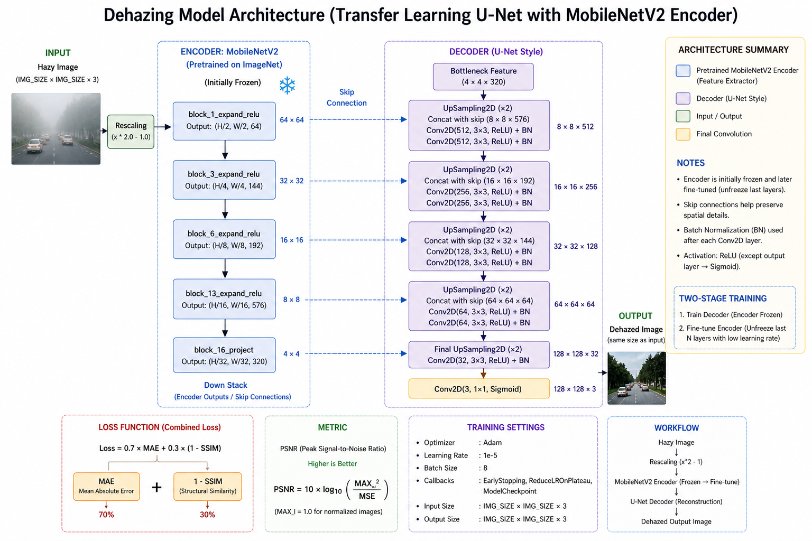

# Image Dehazing using U-Net + MobileNetV2
# Medium article - ...published soon

A deep learning project for restoring clear images from hazy inputs using a U-Net architecture with a pretrained MobileNetV2 encoder.

---

## Highlights

- Transfer Learning with **MobileNetV2**
- U-Net based **encoder–decoder architecture**
- Combined loss: **MAE + SSIM**
- Two-stage training: **decoder training + encoder fine-tuning**
- Achieved ~**25–26 PSNR** on validation set

---

## Model Architecture

The model follows a U-Net style design:

- **Encoder**: MobileNetV2 (ImageNet pretrained)
- **Decoder**: Upsampling + Conv + BatchNorm blocks
- **Skip Connections**: Preserve spatial details

Architecture diagram:



---

## Training Pipeline

### Stage 1 — Decoder Training
- Encoder frozen
- Train decoder layers only
- Faster convergence

### Stage 2 — Fine-tuning
- Unfreeze last encoder layers
- Low learning rate (1e-5)
- Improves reconstruction quality

---

##  Loss Function

Custom combined loss:
-Loss = 0.7 × MAE + 0.3 × (1 − SSIM)   
- MAE → pixel accuracy  
- SSIM → structural similarity

---

## Metrics

- **MSE (Mean Squared Error)**
- **PSNR (Peak Signal-to-Noise Ratio)**

> Higher PSNR indicates better reconstruction quality.

---

## 🖼️ Results

### Qualitative Results

Input (Hazy) vs Output (Predicted) vs Ground Truth 


---

### Training Curves

Decoder Training:


Fine-tuning:


---

## 📁 Dataset

- Paired dataset (Hazy ↔ Clear)
- Resized to **128 × 128**
- Normalized to [0,1]
- Train/Test split: 80/20

---

## 🛠️ Setup

```bash
git clone https://github.com/your-username/image-dehazing.git
cd image-dehazing
pip install -r requirements.txt

